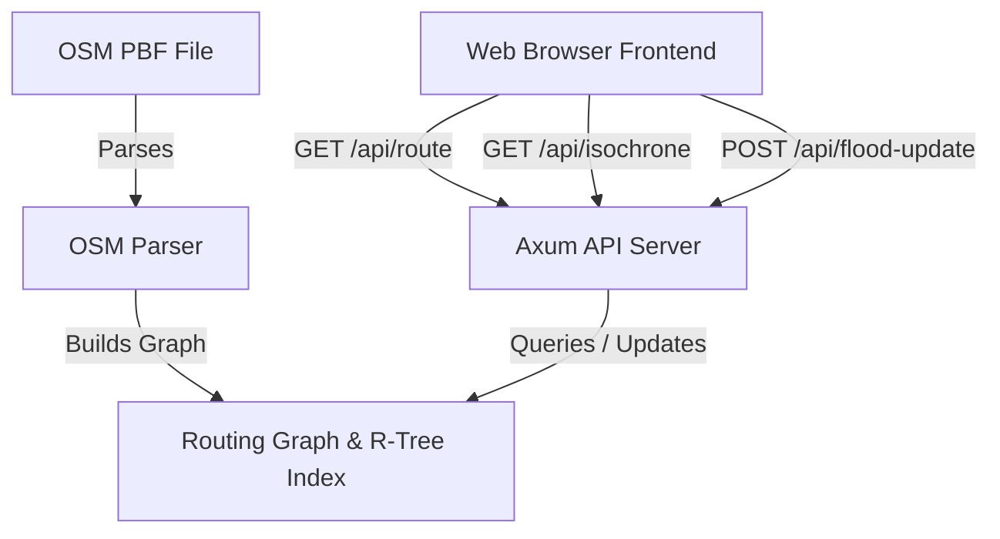

# Pravaaha (AquaRoute)

Pravaaha is a real-time, flood-aware routing engine that computes optimal paths and isochrones by integrating OpenStreetMap (OSM) data with dynamic flood depth updates. It allows emergency response vehicles (like ambulances and rescue trucks) to safely navigate around flooded zones based on their specific clearance heights.

The system is composed of:
1. **A Rust Backend**: An [Axum](https://github.com/tokio-rs/axum)-based web server that parses OSM PBF road networks, builds a spatial R-tree index, updates road flood levels in real time, and executes a customized bidirectional A* algorithm.
2. **A React Frontend**: A React + TypeScript application built with Vite and [React Leaflet](https://react-leaflet.js.org/) for interactive map visualisations, vehicle clearance toggles, and localized flood simulation.

---

## Architecture Overview



### Key Components

*   **OSM PBF Parser (`osm_parser.rs`)**: Uses the `osmpbfreader` crate to ingest road networks (filtered by `highway` tags), computes distances using the Haversine formula, and respects one-way constraints.
*   **Spatial Indexing (`graph.rs`)**: Employs an R-Tree index (via the `rstar` crate) to quickly resolve geographic coordinates (latitude and longitude) to the nearest road edges.
*   **Flood-Aware Bidirectional A* (`routing.rs`)**: Computes paths by searching from both the start and goal simultaneously. Edges exceeding a vehicle's `clearance_mm` are dynamically bypassed during traversal.
*   **Isochrone Explorer (`routing.rs`)**: Uses a modified Dijkstra algorithm to retrieve all road edges reachable from a starting coordinate within a specific time duration, filtering out impassable flooded sections.

---

## Directory Structure

```
pravaaha/
├── backend/                  # Rust Web Server
│   ├── Cargo.toml            # Backend dependencies & configuration
│   └── src/
│       ├── api.rs            # Axum route handlers & serialization
│       ├── graph.rs          # Data structures for nodes, edges, & R-Tree
│       ├── main.rs           # Server entry point & OSM parsing startup
│       ├── osm_parser.rs     # Parser to build graphs from .osm.pbf
│       └── routing.rs        # Bidirectional A* & Isochrone algorithms
├── frontend/                 # React + TypeScript + Vite Application
│   ├── package.json
│   ├── src/
│   │   ├── App.tsx           # Main application shell with Leaflet map
│   │   ├── index.css
│   │   └── main.tsx
│   └── vite.config.ts
├── monaco-latest.osm.pbf     # Sample map dataset for Monaco
└── karnataka-latest.osm.pbf   # Sample map dataset for Karnataka
```

---

## Getting Started

### Prerequisites

*   **Rust**: Ensure you have the Rust toolchain installed (edition 2024 support is required).
*   **Node.js & npm**: Required to build and run the frontend interface.

### Running the Backend

1. Navigate to the `backend/` directory:
   ```bash
   cd backend
   ```
2. Build and run the server (which parses the `monaco-latest.osm.pbf` file by default on startup):
   ```bash
   cargo run --release
   ```
   The backend server will launch and listen on `http://localhost:8080`.

### Running the Frontend

1. Navigate to the `frontend/` directory:
   ```bash
   cd frontend
   ```
2. Install dependencies:
   ```bash
   npm install
   ```
3. Run the development server:
   ```bash
   npm run dev
   ```
4. Open the displayed URL (usually `http://localhost:5173`) in your web browser.

---

## API Endpoints

### 1. Route Calculation
*   **Endpoint**: `GET /api/route`
*   **Query Parameters**:
    *   `start_lat` (f64)
    *   `start_lng` (f64)
    *   `end_lat` (f64)
    *   `end_lng` (f64)
    *   `clearance_mm` (u32): Clearance threshold of the vehicle.
*   **Response**: Returns a GeoJSON `Feature` representing the path (`LineString`), or `null` if no passable route is available.

### 2. Isochrone Generation
*   **Endpoint**: `GET /api/isochrone`
*   **Query Parameters**:
    *   `lat` (f64)
    *   `lng` (f64)
    *   `time_limit_sec` (f64)
    *   `clearance_mm` (u32)
*   **Response**: Returns a GeoJSON array of road segments reachable within the time limit.

### 3. Dynamic Flood Update
*   **Endpoint**: `POST /api/flood-update`
*   **Request Body**: A JSON array of updates containing coordinates and water depths:
    ```json
    [
      {
        "lat": 43.7315,
        "lng": 7.4168,
        "depth_mm": 350
      }
    ]
    ```
*   **Response**: Returns the number of edges successfully updated in the spatial index (as an integer).

---

## Interactive Features (Frontend)

*   **Interactive Waypoint Placement**: Single-click on the map to set the **Start** marker; click again to set the **End** marker. The route is automatically calculated and rendered as a blue line.
*   **Vehicle Clearance Selector**: Choose between:
    *   *Standard Ambulance* (150mm clearance threshold)
    *   *Rescue Truck* (500mm clearance threshold)
*   **Flood Simulator**: Clicking the **"Simulate Flood near Start"** button reports random flood depths (300mm) at 100 nearby nodes. The routing engine dynamically recalculates a detour avoiding these sectors if the vehicle's clearance is lower than the flood depth.
